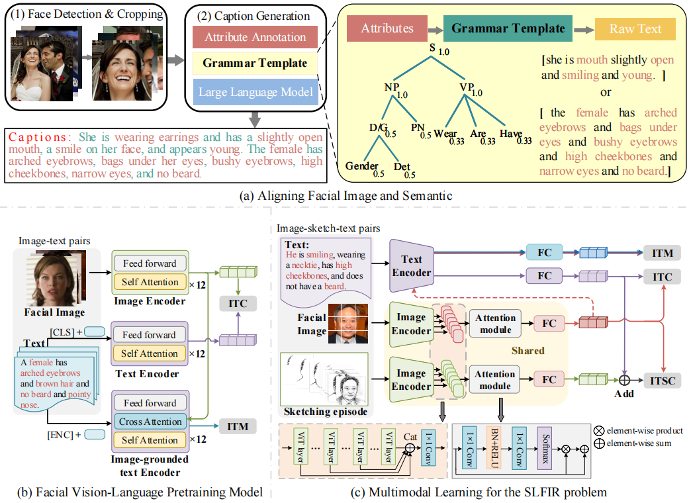

# Vision-Language Joint Representation Learning for Sketch Less Facial Image Retrieval
## 🌟 Pipeline

    

## 💾 Dataset
FaceCaption-15M is available at: **[FaceCaption-15M](https://huggingface.co/datasets/OpenFace-CQUPT/FaceCaption-15M)**
 
**The [FS2K-SDE](https://github.com/ddw2AIGROUP2CQUPT/FS2K-SDE) dataset** comprises two subsets: the FS2K-SDE1 dataset with 75,530 sketches (1,079 images for training, with the remainder being allocated for testing) and the FS2K-SDE2 dataset with 23,380 sketches (334 images for training, with the remaining sketches and images being used for testing).

## Models
Based on FaceCaption-15M, we trained a multimodal representation model [FLIP](https://huggingface.co/OpenFace-CQUPT/FLIP), similar in concept to CLIP, designed for aligning facial images with semantics.

## 📔 Citation
Dawei Dai, Shiyu Fu, Yingge Liu, Guoyin Wang,
Vision-language joint representation learning for sketch less facial image retrieval,
Information Fusion,
2024,
102535,
ISSN 1566-2535,
https://doi.org/10.1016/j.inffus.2024.102535.
